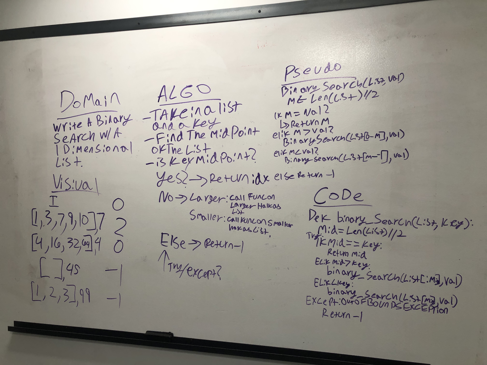

# Array Binary Search - 7/10/19

This challenge makes use of recursion to keep searching through the array, and a try/except block for the conditional if the value is never located.

## Challenge

Write a binary search that takes a value and an array, and returns the index of the value if found, -1 if not.

## Approach & Efficiency

I wanted to push myself to whiteboard effective recursion for this challenge, partially because I know it is an effective method for solving this problem, partially because its a lot of fun. In the end, an if/elif block that has recursive branches, wrapped in a try/except to account for a potential lack of value, and a break case set to the successful location of the key value rounds out this solution.

In the worst case scenario, this function will have to check 1/2 of the list against the key, so it will be O(log(n)). 

 [source](https://wiki.python.org/moin/TimeComplexity)

## Solution

