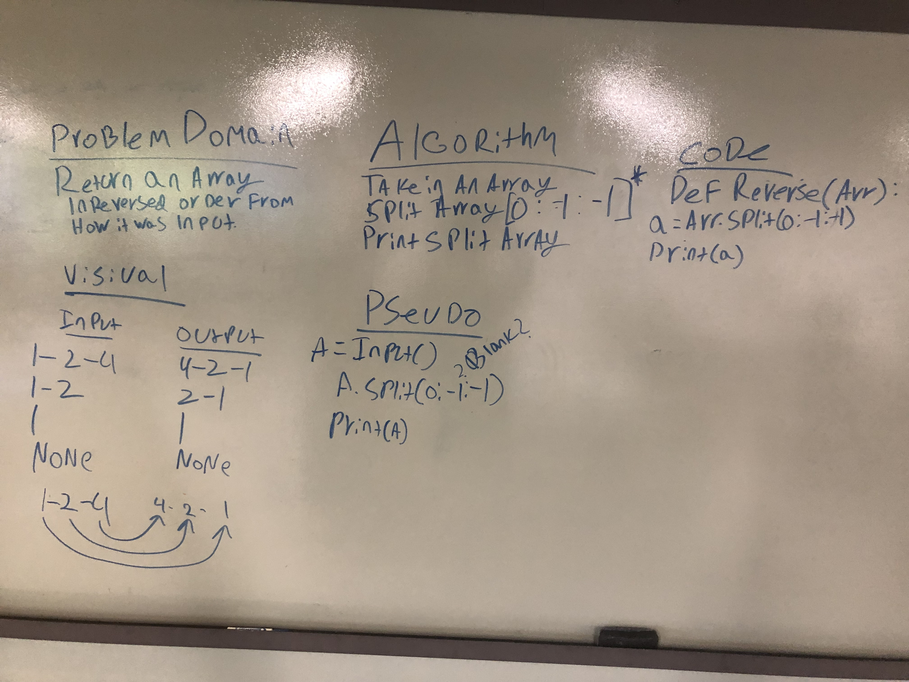

# Reverse an Array

This first challenge in the python 401 makes use of the python slice method to reverse an array.

## Challenge

Take in an array as an argument and return a reversed version of it.

## Approach & Efficiency

I opted to use a slice with a -1 stride to reverse the array, reassign the new version to the input variable, and return it.

When looking into the O Complexity of this approach, it looks like it is O(k) for both time and space, where k refers to the value of the parameters. [source](https://wiki.python.org/moin/TimeComplexity)

## Solution

