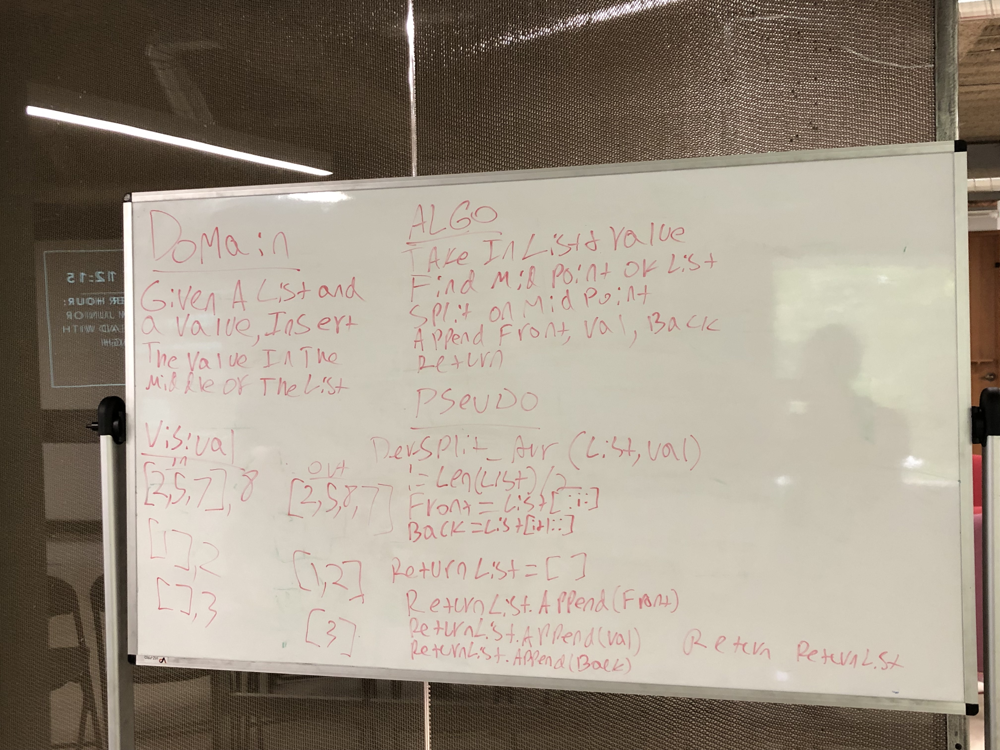

# Shift an Array - 7/8/19

In this shift challenge, both the append and the extend methods are utilized to ensure a clean return list strictly composed of integers.

## Challenge

Given a list and a value, insert the value in the middle of the list and return it.

## Approach & Efficiency

While python has a native insert function, by avoiding it this solution is actually more efficient. It utilizes 2 slices, an append, and and an extend - all of which are O(k) where k == the number of the elements in the parameter(which are consistently at least half of the whole list). Insert on a list is O(n). While insert may be more convenient, a few more lines can save on time and space when it counts.
 [source](https://wiki.python.org/moin/TimeComplexity)

## Solution

