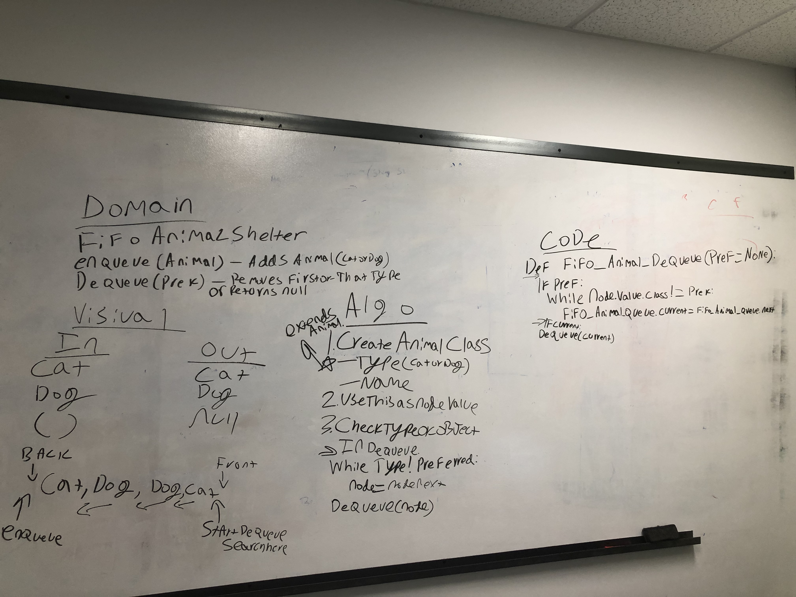

# First In First Out Animal Shelter - 7/23/19

This challenge mimics an animal shelter which only takes dogs and cats, and adopts out its animals on a first in and first out basis. 

## Challenge

Write a class that implements the methods of a queue, but stores dogs and cats and allows the user to request either a dog, a cat, or no preference. The shelter is to return the preferred animal that has been in the queue the longest. If there is no preference, it is to return the animal of either type that has been in the queue the longest.

## Approach & Efficiency

I opted to utilize my already written enqueue method for adding animals to the shelter as it runs well. In order to keep track of if a given node was a cat or a dog I created an Animal class which kept track of a name and a type. The subsequent object is passed in as the value for enqueue. 

Dequeue is where most of the heavy lifting is, as it iterates over each animal checking if it is of the preferred type and returning the first one found. If no preference is given, dequeue simply returns the first animal in the queue.

## Solution

