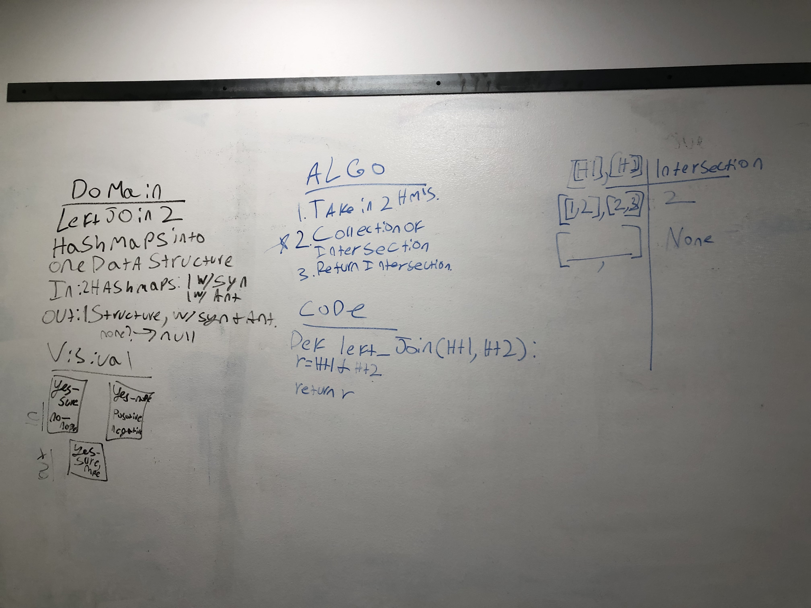

# Left Join of 2 Hashtables 8/21/19

## Challenge

Construct a function that returns and effective "left join" for two hash tables.

## Approach & Efficiency

My initial approach utilized the python intersection method. This has thus far proven unsuccessful, and I suspect I will need to reassess how I am taking this on to produce a functioning product. 

## Solution

