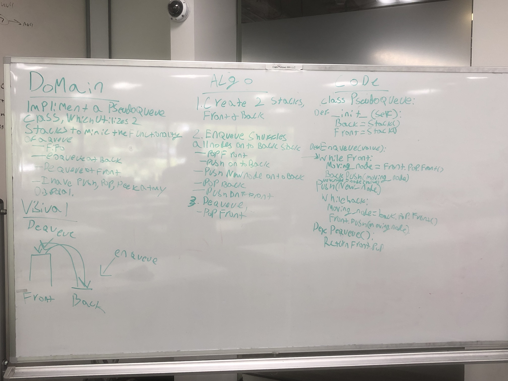

# A Queue with 2 Stacks

Mimic the functionality of a queue utilizing two stacks.

## Challenge

Use two stacks to create a structure that functions on the FIFO principal. It needs to be able to enqueue and dequeue, and can utilize all the methods on the implementation of a stack in this repo.

## Approach & Efficiency

As one of the methods on this challenge had to be O(n), I opted to make my enqueue utilize the while loops necessary to keep track of where the stack was situated, front or back. This allowed for an O(1) dequeue method, simply rearranging pointers and returning a value. I always know my pseudoqueue is settled with the front stack full, only accessing the back stack when a value needs to be enqueued.

## Solution

