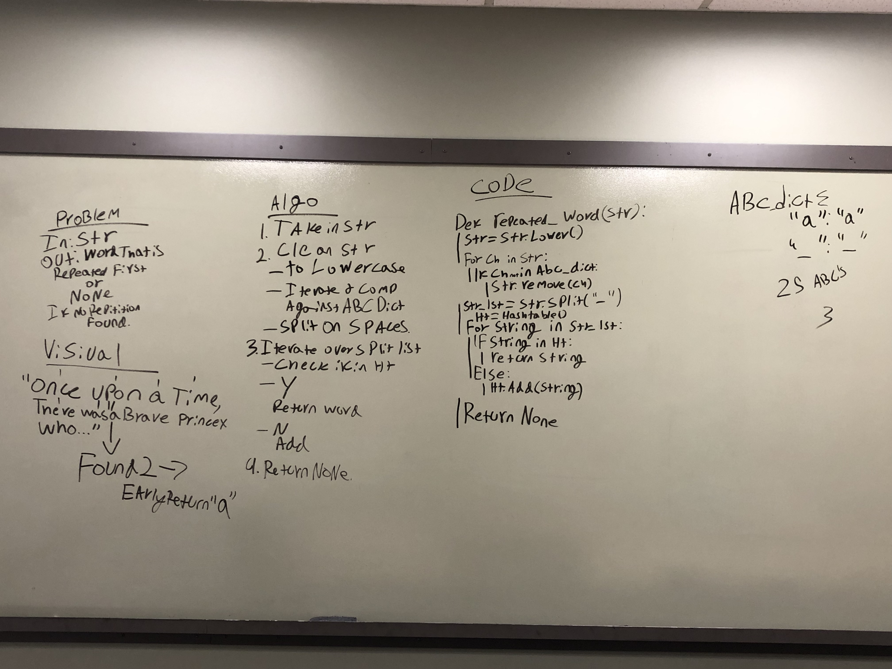

# Challenge Summary

Find the first repeated word in a book, or any length string.

## Challenge Description

Given a string of indeterminate length, determine what the first repeated word is and return it. If there are no repeated words, return None.

## Approach & Efficiency

As this challenge was concerned with unique values, rather, when values were no longer unique, my first inclination was to use a hashtable to track unique words. After that decision was made, it was fairly simple to determine that the .contains function would be necessary to check if a word was already stored in the table. 

Cleaning the string was an entirely different matter. I opted for a dictionary of the values I knew we would want to be considering, ie. the lower case alphabet and spaces, as it would be far more manageable to maintain than a dictionary of values I wanted to exclude. For readability I housed this in its own file, and imported into the repeated_word function. Replacing an unwanted character with nothing is effectively removing it, and works as such in this case.

## Solution

